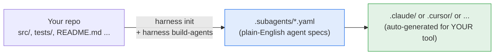

# Harness Stack

**Harness Stack keeps your AI coding tool honest.** It automatically checks
that your tests actually cover what you just changed, flags docs that fell out
of sync with the code, and remembers *why* past changes were made — so you
(and your team) stop re-explaining the codebase to your AI tool every single
session.

You run one command (`harness init`) inside your own repo. It works with
whatever AI coding tool you already use — Claude Code, Cursor, Codex,
Antigravity, or GitHub Copilot. **No AI/ML background required.**

---

## 🧩 What you actually get

| When you... | Harness... |
| --- | --- |
| Write new code and try to commit | 🧪 Checks the change is covered by tests — writes them for you if you say yes |
| Change code but forget the docs | 📝 Catches doc/README/comment drift against the diff, before it ships |
| Come back to the repo tomorrow (or a teammate does) | 🧠 Has already logged *what changed and why*, so no one re-explains context to the AI from scratch |
| Ask your AI tool for help | 🔀 Routes the request to a small, focused specialist agent instead of one general-purpose assistant guessing |
| Open a generated file | 📂 It's plain YAML/Markdown — readable in five minutes, editable, deletable. Nothing hidden, nothing trained |

## 🤔 "Doesn't my AI coding tool already do this?"

Not really. Claude Code, Cursor, and friends are general-purpose assistants —
they help when you ask, and they forget everything the moment the session
ends. Harness Stack adds the parts a plain assistant doesn't do on its own:

- **It runs automatically**, wired into events you already trigger (`git
  commit`, project init) — not just when you remember to ask.
- **It's made of small, single-job agents** (write missing tests, spot doc
  drift, log the "why") instead of one assistant trying to do everything from
  a blank slate.
- **It has memory across sessions and repos** (via the optional
  [harness-brain](https://github.com/cloudbloqavi/harness-brain)), so context
  survives past today's chat window.
- **It's the same behavior regardless of which AI tool you pick** — switch
  from Claude Code to Cursor and the same checks still run.

If that's not a gap you feel today, you may not need this yet — and that's a
fine answer too.



Nothing here trains a model or calls a hosted service on your behalf — it
generates plain text files (YAML/Markdown/TOML) that your existing AI coding
tool reads. Open any generated file, read it in five minutes, delete it if you
don't like it.

**Jump to:** [Use Harness in another repo](#use-harness-in-another-repo) ·
[Deep dive (design principles + architecture)](#deep-dive-how-it-works) ·
[Contributing](#contributing)

<a id="use-harness-in-another-repo"></a>

## 🚀 Use Harness in another repo

This is the main walkthrough — follow it top to bottom in **your own**
project (a full-stack app, a backend service, a mobile app, a library,
anything). It assumes no prior experience with Harness or with AI agents.

### Step 0 — Check prerequisites

You need **Node.js 20 or newer** and **git**. Check what you have:

```bash
node -v     # must print v20.x.x or higher
git --version
```

Don't have Node 20+? Install it from [nodejs.org](https://nodejs.org) or with
a version manager like [nvm](https://github.com/nvm-sh/nvm)
(`nvm install 20 && nvm use 20`).

### Step 1 — Install the `harness` CLI

Harness Stack isn't on the npm registry yet (see
[Contributing](#contributing) if you'd like to help change that), but it
installs the same way — straight from GitHub — and gives you a global
`harness` command:

```bash
npm install -g git+https://github.com/cloudbloqavi/harness-stack.git
```

Confirm it worked:

```bash
harness --version
# 0.1.0
```

<details>
<summary><strong>Global install failed, or you'd rather not install globally?</strong></summary>

- **Permission error (EACCES)** — your npm is set up to need `sudo` for
  global installs. Either re-run with `sudo npm install -g ...`, or (recommended)
  fix npm's global prefix once by following the
  [official npm guide](https://docs.npmjs.com/resolving-eacces-permissions-errors-when-installing-packages-globally).
- **`nvm`-managed Node** — this is usually the smoothest path; nvm's global
  installs don't need `sudo`.
- **Don't want a global install** — clone the repo and run it locally instead:
  ```bash
  git clone https://github.com/cloudbloqavi/harness-stack.git
  cd harness-stack && npm install && npm run build
  npm link                 # makes `harness` available globally from this checkout
  # or, without linking, from inside harness-stack/:
  npm run harness -- <command>
  ```

</details>

### Step 2 — Go to *your* project

```bash
cd ~/code/my-backend-service      # or your full-stack app, mobile repo, etc.
```

Harness always works on **the directory you run it from** — there's nothing
to point at your project's name or type; it figures that out.

### Step 3 — Run `harness init`

```bash
harness init
```

This asks you a few questions, interactively:

```
? Which agentic platform(s) do you use? (space to select, enter to confirm)
  ◉ Claude Code
  ◯ Cursor
  ◯ Codex
  ◯ Antigravity
  ◯ GitHub Copilot

? Set up harness-brain (git-backed commit memory)? (y/N)
? Path for harness-brain [../harness-brain]:
```

- **Platform(s):** pick whichever AI coding tool(s) you actually use — you can
  pick more than one, and Harness will generate files for all of them.
- **harness-brain:** optional (see [below](#optional-commit-memory-harness-brain));
  safe to say **no** for your first run, you can add it later.

When it finishes, your repo has two new, plain-text folders:

```
your-project/
├── .subagents/              ← the sub-agents, as readable YAML — edit these
│   ├── harness-init-agent.yaml
│   ├── test-author-agent.yaml
│   └── ...
├── .harness/                ← Harness's own config (model map, trigger map, ...)
│   └── config.yaml
├── AGENTS.md                ← operating rules appended for your main AI agent
└── (everything else you already had, untouched)
```

Nothing here is a black box — every file is Markdown, YAML, or JSON. Open
`.subagents/test-author-agent.yaml` right now and read it; it's a plain-English
job description.

### Step 4 — Generate the files your AI tool actually reads

```bash
harness build-agents
```

This reads every file in `.subagents/` and writes the **native** files your
chosen platform(s) expect. For Claude Code, for example:

```
your-project/
├── .claude/
│   ├── agents/                  ← one file per sub-agent
│   │   ├── test-author-agent.md
│   │   └── ...
│   ├── skills/                  ← decision-routable skills (auto-picked by the AI)
│   └── commands/                ← manual slash commands, e.g. /verify
```

If you picked Cursor, Codex, Antigravity, or Copilot instead (or as well),
you'll see `.cursor/`, `.codex/`, `.agents/`, or `.github/agents/` — see
[the architecture diagram](#deep-dive-how-it-works) for the full map.

**Re-run `harness build-agents` any time you edit a `.subagents/*.yaml` file** —
generated files are always overwritten, so never hand-edit them.

### Step 5 — Try it

Open your AI coding tool inside this repo as normal, and either:

- **Ask it something naturally** — e.g. "review my recent changes for missing
  tests." A well-picked sub-agent (`test-author-agent`) can be routed to
  automatically if it was exposed as a skill.
- **Or invoke a command directly** — run `harness skills` to see the exact
  slash command for each agent (e.g. `/verify`, `/review-drift`), then type it
  in your AI tool's chat.

```bash
harness skills      # shows: agent -> which files it produced -> how to invoke it
harness agent list  # browse every registered sub-agent and what it does
harness hooks       # see which native event (or git hook) triggers each agent
harness check --all # preview the pre-commit orchestration plan
```

### Step 6 — Commit the generated files

`.subagents/`, `.harness/`, `AGENTS.md`, and the platform folders
(`.claude/`, `.cursor/`, etc.) are meant to be **committed to git** — that's
the whole point of "auditable": every teammate (and every PR reviewer) can see
exactly what each agent is allowed to do, as a diffable text file.

```bash
git add .subagents .harness AGENTS.md .claude   # (or whichever platform folder you generated)
git commit -m "Add Harness sub-agents"
```

### Optional: commit-memory (`harness-brain`)

Harness can also keep a running, human-readable log of *what changed and why*
across your commits, written by `commit-brain-agent` into a companion
repository: [harness-brain](https://github.com/cloudbloqavi/harness-brain).
It's entirely opt-in.

```bash
harness init --brain ../harness-brain                     # clone the shared example repo
harness init --brain ./memory --brain-source scaffold     # or: local skeleton, no network needed
harness init --skip-brain                                 # or: skip it (default if you say "no" at the prompt)
```

- **clone** pulls the [harness-brain](https://github.com/cloudbloqavi/harness-brain)
  repo, complete with worked examples you can look at and adapt.
- **scaffold** creates the same folder structure locally, offline, with no
  network call.

Either way, the choice is saved under `brain:` in `.harness/config.yaml`, and
you point the agents at it with:

```bash
export HARNESS_BRAIN_PATH=/path/to/harness-brain
```

Full explanation, examples, and how to add your own project to it: see the
[harness-brain README](https://github.com/cloudbloqavi/harness-brain#readme).

### Troubleshooting

| Problem | Fix |
| --- | --- |
| `harness: command not found` | The global `npm bin` isn't on your `PATH`. Run `npm config get prefix`, then add `<that path>/bin` to your shell's `PATH`. Or use `npm link` from a local clone (Step 1). |
| `npm install -g ...` fails with `'tsc' is not recognized as an internal or external command` (Windows) | The install builds the package from source, and that build used to shell out to the bare `tsc` command. On Windows, npm's internal git-dependency prepare step doesn't always put `node_modules/.bin` on `PATH`, so `tsc` couldn't be found even though it was installed. This is fixed on `main` (the build now invokes `node_modules/typescript/bin/tsc` via `node` directly) — just re-run the Step 1 install command to pick it up. Still hitting it? Use the local-clone fallback in Step 1 (`git clone ... && npm install && npm run build && npm link`), which builds in your normal shell instead of npm's internal prepare pipeline. |
| `harness build-agents` fails with a fresh-context error | An agent needs a web-search tool + Context7 and your platform doesn't expose one yet. Re-run `harness init` and make sure you picked the right platform(s). |
| Nothing happens when I ask my AI tool to use a sub-agent | Run `harness skills` — if the agent is command-only (not a "skill"), you need to invoke its slash command directly. |
| I want to update to the latest Harness version | Re-run Step 1's install command — it reinstalls from the `main` branch. |

<a id="deep-dive-how-it-works"></a>

## 🧠 Deep dive: how it works

The rest of this README is for people who want to understand — or modify —
what's actually happening under the hood. Skip it if you just want to use
Harness day to day.

### Design principles

- **Platform-agnostic by construction.** No agent spec names a concrete model
  or a platform-specific tool. Agents declare an abstract **model tier** and
  abstract **capabilities**; the active platform adapter resolves them.
- **Fresh-context by mandate.** Any agent that reasons about libraries, APIs,
  versions, or CVEs runs with web search + **Context7** wired — never stale
  training data.
- **Spec-driven by default.** Harness installs vetted foundations (**Spec Kit**
  and **Superpowers**) and surfaces their skills through a consent-gated
  recommendation protocol.
- **Auditable.** Every sub-agent is a diffable `.yaml` in `.subagents/`.

## Architecture

```
                         +------------------------------+
                         |        harness CLI           |
                         |  init · build-agents · agent |
                         |         · check              |
                         +---------------+--------------+
                                         |
              +--------------------------+--------------------------+
              v                          v                          v
   +---------------------+   +-----------------------+   +---------------------+
   |   .subagents/*.yaml |   |  .harness/            |   |  AGENTS.md          |
   |  (source of truth)  |   |   model-map.yaml      |   |  (operating rules:  |
   |  name, tier,        |   |   trigger-map.yaml    |   |   fresh-context for  |
   |  capabilities,      |   |   allowlists/*.yaml   |   |   the main agent)   |
   |  triggers, prompt   |   |   config.yaml         |   +---------------------+
   +----------+----------+   |   (enabled platforms) |
              |              +-----------+-----------+
              |                          |
              |   harness build-agents   |
              v                          v
   +-------------------------------------------------------------+
   |                    RESOLUTION PIPELINE                       |
   |                                                             |
   |   model_tier  --[ model-map ]--->  concrete model           |
   |   capabilities --[ adapter ]---->  native tools             |
   |   triggers    --[ trigger-map ]->  native hooks / fallback  |
   |   requires_fresh_context ------->  assert web_search+Context7|
   |                              (else: fail with clear error)  |
   +------------------------------+------------------------------+
                                  |
       +----------+----------+----+-----+----------+-----------+
       v          v          v          v          v
  +---------+ +-----------+ +---------+ +---------+ +-------------+
  | Claude  | |Antigravity| | Codex   | | Cursor  | | Copilot     |
  |.claude/ | |.agents/   | |.codex/  | |.cursor/ | |.github/     |
  | agents/ | | skills/   | | agents/ | | agents/ | | agents/     |
  | *.md    | | SKILL.md  | | *.toml  | | *.md    | | *.agent.md  |
  +---------+ +-----------+ +---------+ +---------+ +-------------+
       \_______ trigger -> native hook (or git-hook / harness fallback) ______/

   Orchestrator (harness check) reads the same specs and computes a
   resource-aware parallel batch: CPU cap + 70% memory budget + priority.

   Agent artifacts:
     commit-brain-agent        --writes--> harness-brain   (per-commit memory)
     cross-repo-discovery-agent --reads--> harness-brain   (session digest) [Phase 2]
     dependency-audit-agent    --writes--> DEPENDENCIES.md (latest/EOL/deprecated)
     test-author-agent         --writes--> test files      (consent-gated)
```

## Agent roster (by trigger)

```
   on_init ───────────────┐   project start (greenfield & brownfield)
     harness-init-agent    |   classify, gap report, install base tooling
     spec-author-agent     |   Spec Kit: constitution -> spec -> plan -> tasks
     dependency-audit-agent|   build/refresh DEPENDENCIES.md
                           |
   on_demand ─────────────┤   you ask, or the orchestrator routes a task
     skills-router-agent   |   rank skills (consent-gated)
     mcp-router-agent      |   rank MCP servers (consent-gated)
     dependency-audit-agent|   re-audit dependencies on request
     test-author-agent     |   review tests; author missing ones (on consent)
                           |
   on_check ──────────────┤   harness check [--all]  — pre-commit gate (parallel)
     drift-reviewer-agent  |   semantic: docstring / doc / low-level-design drift
     verifier-agent        |   executable: change covered by passing tests (no write)
     test-author-agent     |   coverage/quality review
                           |
   on_commit ─────────────┘   git commit hook
     commit-brain-agent    |   summarise the diff into harness-brain
```

> `drift-reviewer-agent` and `verifier-agent` also declare `on_demand`, so you
> can invoke the verification pair directly (`/review-drift`, `/verify`) as well
> as via the `on_check` gate.

## How it works

```
.subagents/<agent>.yaml      <- canonical, platform-agnostic source of truth
        |  harness build-agents
        v
.claude/agents/<name>.md           <- Claude Code  (sub-agent, YAML frontmatter)
.cursor/agents/<name>.md           <- Cursor       (sub-agent, YAML frontmatter)
.codex/agents/<name>.toml          <- Codex        (custom agent, TOML)
.agents/skills/<name>/SKILL.md     <- Antigravity  (Agent Skill — the sub-agent)
.github/agents/<name>.agent.md     <- Copilot      (custom agent — the sub-agent)

.claude/skills/<command>/SKILL.md  <- decision-routed skill  (when expose_as has "skill")
.claude/commands/<command>.md      <- manual slash command    (when expose_as has "command")
   (per-platform native paths for skill/command — see the table below;
    on Antigravity & Copilot the sub-agent above IS the decision-routed skill)
```

- **Edit the YAML, not the generated files.** Generated files are overwritten on
  every build.
- **Model names live in one place** — `.harness/model-map.yaml`. Agents declare
  a `model_tier` (`fast` / `reasoning` / `deep` / `inherit`); the adapter
  substitutes the concrete model per platform. Update the map, nothing else
  changes.
- **Capabilities are abstract** (`read` / `write` / `exec` / `web_search` /
  `web_fetch`). The adapter maps them to native tools.
- **Triggers are abstract** (`on_init` / `on_commit` / `on_check` /
  `on_demand`); see below.

### Triggers → native event hooks

Different platforms expose different event hooks. Agents declare abstract
triggers, and `.harness/trigger-map.yaml` resolves each to the active platform's
**native hook** — or, where the platform has no equivalent, to a Harness
fallback (an installed **git hook** for `on_commit`, or `harness check` for
`on_check`). Run `harness hooks` to see the wiring plan.

Because hook APIs drift, the map ships with best-known defaults flagged
`verified: false`; at `init` the `harness-init-agent` **researches the chosen
platform's current hook docs** (search + Context7) and refreshes the map before
wiring. This is why `init` asks which platform you use first.

### Agents as skills & slash commands

A sub-agent is always generated. Beyond that, each agent declares how it can be
**invoked**, via `expose_as` in its `.subagents/*.yaml`:

- **`skill`** — a **decision-routed** surface the main agent can choose to run.
- **`command`** — a **manual** slash command you invoke directly.

Both are **thin launchers** that hand off to the same sub-agent, so the
`.subagents` prompt stays the single source of truth. The name is `command:` (or
the agent name minus `-agent`). Run **`harness skills`** to see each agent's
surfaces. Each platform's surfaces use that platform's **native, verified**
mechanism:

| Platform | `skill` (decision-routed) | `command` (manual) |
| --- | --- | --- |
| Claude Code | `.claude/skills/<c>/SKILL.md` | `.claude/commands/<c>.md` → `/<c>` |
| Cursor (2.4) | `.cursor/skills/<c>/SKILL.md` | `.cursor/commands/<c>.md` → `/<c>` |
| Codex | `.agents/skills/<c>/SKILL.md` (implicit) | same skill, explicit `$<c>` (`allow_implicit_invocation: false`) |
| Antigravity | *the sub-agent* `.agents/skills/<name>/SKILL.md` | `.agents/workflows/<c>.md` → `/<c>` |
| GitHub Copilot | *the sub-agent* `.github/agents/<name>.agent.md` | `.github/prompts/<c>.prompt.md` → `/<c>` |

On **Antigravity and Copilot the sub-agent file is already the decision-routed
skill**, so no separate thin skill is emitted — only the manual command. On
Claude/Cursor/Codex the skill is a separate thin launcher. Cursor, Codex, and
Antigravity all read the portable **Agent Skills** standard (`SKILL.md`).
Defaults: light routing agents (`skills-router`, `mcp-router`,
`commit-brain`) and the pre-commit verification pair (`drift-reviewer`,
`verifier`) are exposed as **both** a skill and a command — the pair need to be
decision-routable on `on_check`; heavier fresh-context agents (`harness-init`,
`dependency-audit`, `spec-author`, `test-author`) get a **manual command** only
— so the model doesn't auto-launch an expensive job.

As with hooks, mechanisms drift, so the bundled mappings are verified now and the
`harness-init-agent` **re-checks them at init** (search + Context7).

### Fresh-context enforcement

Any agent with `requires_fresh_context: true` must resolve a web-search tool
**and** have Context7 available, or `harness build-agents` fails with an
actionable error. Context7 is installed as a base MCP at `init`, and the
operating-rules fragment written into `AGENTS.md` extends the rule to the main
agent.

### Discovery & reuse

`harness agent create <task>` follows reuse-before-create:

1. **Exact match** by name -> reuse.
2. **Similar match** (overlap score >= 0.75) -> offer to reuse/extend.
3. **Create new** -> consent-gated scaffold, then regenerate the README index.

### Resource-aware orchestration

`harness check` computes the parallel batch: CPU cap (`cores - 1`), a 70%
free-memory budget (per-agent `max_memory_mb` hints, 256 MB default),
high-priority first, non-parallelizable agents sequenced.

### Agentic loops (context reset + verification gate)

Harness sits *beneath* an agentic loop and supplies its disciplines without
building an uncontrolled one. `harness seed` materializes the **iteration
seed** — the stable north-star (from `.harness/SEED.md`, a Spec Kit spec, or the
README) plus the brain's compact rollup as the current-state digest — so each
iteration re-seeds from a source of truth instead of drifting on its own
transcript. The `drift-reviewer-agent` (semantic) and `verifier-agent`
(executable) form the independent stop/continue gate on `on_check`. Human-in-
the-loop is the default; the autonomous controller is opt-in and deferred. See
[`docs/agentic-loop.md`](docs/agentic-loop.md).

## The v1 agent catalog

| Agent | Tier | Purpose |
| --- | --- | --- |
| `harness-init-agent` | reasoning | Classify project, gap report, install base tooling |
| `spec-author-agent` | reasoning | Drive Spec Kit constitution -> spec -> plan -> tasks |
| `skills-router-agent` | fast | Rank skills across sources, consent-gated |
| `mcp-router-agent` | fast | Rank MCP servers from the curated allowlist |
| `commit-brain-agent` | fast | Write per-commit summaries into `harness-brain` |
| `dependency-audit-agent` | reasoning | Maintain `DEPENDENCIES.md` (latest / outdated / deprecated / EOL) from live data |
| `test-author-agent` | reasoning | Review unit tests, surface gaps, author missing tests on consent |
| `drift-reviewer-agent` | reasoning | Pre-commit semantic check: flag/fix docstring, doc & low-level-design drift vs the diff (docs only) |
| `verifier-agent` | reasoning | Pre-commit executable check: independently confirm the change is covered by passing tests (no `write`; delegates authoring to `test-author-agent`, owns the verdict) |

See [`docs/spec-subagents.md`](docs/spec-subagents.md) for the full design spec
and the Phase 2/3 catalog.

<a id="contributing"></a>

## 🤝 Contributing

Harness Stack is open source (MIT) and **contributions are welcome** — you
don't need deep AI experience to help. Good starting points: fixing a docs
typo, adding a worked example, improving an error message, or picking up a
Phase 2 agent from [`docs/spec-subagents.md`](docs/spec-subagents.md).

**Quick setup:**

```bash
git clone https://github.com/cloudbloqavi/harness-stack.git
cd harness-stack
npm install
npm test              # vitest — should be all green before you start
```

**While you work:**

```bash
npm run typecheck             # tsc --noEmit
npm test                      # vitest
npm run build                 # compile to dist/
npm run verify:brain-template # templates/brain/ matches the harness-brain repo
```

`templates/brain/` is the offline scaffold and must stay in sync with the
[harness-brain](https://github.com/cloudbloqavi/harness-brain) example repo.
`verify:brain-template` diffs them (defaults to a `../harness-brain` sibling
checkout, or pass a path / set `HARNESS_BRAIN_DIR`); CI runs the same check.

Full guide (branching, commit style, opening a PR, what a good first PR looks
like): see [**CONTRIBUTING.md**](CONTRIBUTING.md). Questions or ideas? Open a
[GitHub issue](https://github.com/cloudbloqavi/harness-stack/issues) — there's
no such thing as a question too small.

## License

MIT — see [LICENSE](LICENSE).
