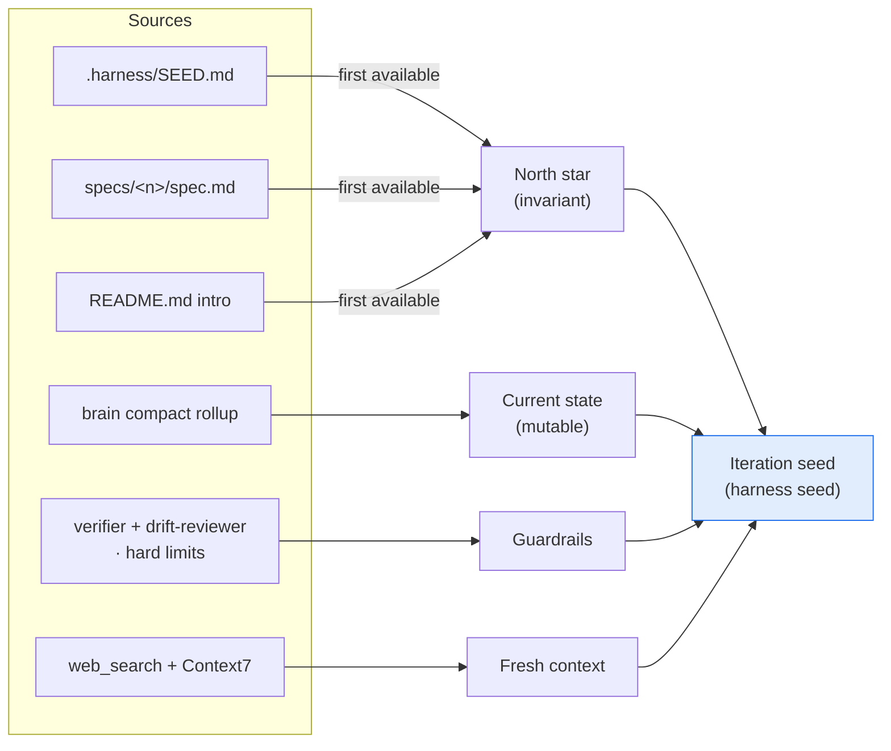
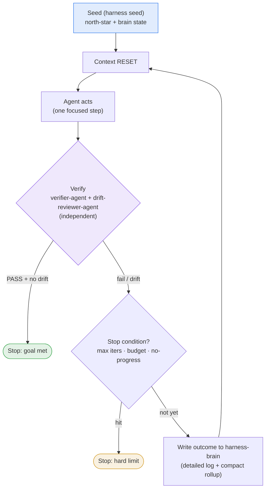

# Agentic loops in Harness

*How the "loop engineering" pattern maps onto Harness — what we adopt, what we
deliberately diverge on, and the iteration contract the pieces already
implement.*

An **agentic loop** is a system that re-runs an agent until a goal or stopping
condition is met — *"a cron job plus a decision-maker."* Unlike a fixed script,
each turn reads the current state of the work, decides the next action, acts,
and verifies, then decides whether to continue or stop.

Harness is **not** a loop, and it does not compete with one. Harness is the
layer *beneath* a loop: how agents are defined, exposed, and routed
(`.subagents/*.yaml` → per-platform files), plus durable memory
(`harness-brain`). A loop would sit *on top*. Most of what a robust loop needs,
Harness already provides — so we adopt the pattern's disciplines without
building an uncontrolled loop.

## What a loop needs vs. what Harness provides

| Loop component | In Harness | Status |
| --- | --- | --- |
| **Worktrees** (isolation) | Ephemeral per-session worktree containers | ✅ |
| **Reusable skills** | `expose_as: [skill, command]`, verified on 5 platforms | ✅ |
| **Connectors** (external tools) | MCP routing (`mcp-router-agent`) | ✅ |
| **Disk memory** | `harness-brain` — git-backed, append-only Markdown | ✅ |
| **Independent verifier** | `verifier-agent` + `drift-reviewer-agent` | ✅ |
| **Context reset / re-seed** | The **iteration seed** (`harness seed`) | ✅ this doc |
| **Fresh research each turn** | `requires_fresh_context` (web_search + Context7) | ✅ |
| **Hard stopping conditions** | Contract below; enforced by the (future) controller | ◻ deferred |
| **Loop controller** | Opt-in, user-triggered — **future work** | ◻ deferred |

## Where we deliberately diverge

Harness is the *disciplined* end of the loop spectrum, not the AutoGPT end:

- **Human-in-the-loop is the default.** Consent-gating and pre-commit review are
  features, not friction. The autonomous controller is strictly opt-in.
- **Legibility over autonomy.** The pattern's sharpest risk is *quiet success* —
  the agent succeeding in ways you don't understand. `harness-brain`'s detailed
  logs + compact rollups are the antidote: every change is auditable after the
  fact.
- **Independence is structural, not advisory.** The `verifier-agent` is
  resolved with **no file-editing (`write`) capability** — it gets no Write/Edit
  tools, so it delegates test authoring to `test-author-agent` rather than
  grading work it wrote itself.

## The iteration contract

The loop's number-one failure mode is **drift**: each turn accretes noise from
the last and the agent slowly forgets the goal. The fix is to **reset context
every iteration** and re-seed from a stable source of truth — never from the
previous turn's transcript. Harness materializes that seed today with
`harness seed` (usable in the default human-in-the-loop mode, and the exact
input the future controller will feed automatically).

The seed has two planes plus two woven-in guardrails:

1. **North star (invariant)** — the goal/spec, fed *unchanged* every iteration.
   Resolved from the first available of: `.harness/SEED.md` → the newest
   `specs/<n>/spec.md` (Spec Kit) → the `README.md` intro. A **precise** seed is
   the single biggest lever on loop quality; a vague one compounds into
   confident, repeated errors.
2. **Current state (mutable)** — the brain's compact rollup: *"read the current
   state of the work before acting."* See [Brain as loop-state](#brain-as-loop-state).
3. **Guardrails** — the stop/continue signal (the verification pair) and the
   mandatory hard limits.
4. **Fresh context** — re-verify library/API/version/CVE facts via
   web_search + Context7 each turn, never from stale memory.

First, how the seed itself is assembled — the sources on the left collapse into
the four planes fed each iteration:



Then the loop consumes that seed, resetting context every turn:



Each turn re-seeds from the **top** (north-star + refreshed brain state), not
from the accumulated transcript — that is the context reset that prevents drift.

## Brain as loop-state

`harness-brain` is not just memory — it is the loop's **externalized state**,
and its two file kinds map cleanly onto the two things a loop needs:

| Brain file | Role in the loop |
| --- | --- |
| **Compact rollup** (`<YY-MM-DD>-HAR-compact.md`, one per brain) | The **current-state digest** re-injected each iteration. Small, current, "what's the state of the work right now." |
| **Detailed log** (`<repo>/<YY-MM-DD>-HAR.md`, append-only) | The **audit trail** — the full record that closes the *quiet success* gap. Not fed into the seed; read when a human (or the discovery agent) needs the why. |

So "feed core instructions, clear the noise each iteration" becomes concrete:
feed the **north-star + compact rollup**, and leave the detailed logs as the
durable record behind them.

## Stopping conditions (mandatory)

A loop with no stop is a runaway cost. Every loop must define:

- **Success** — `verifier-agent` returns **PASS** *and* `drift-reviewer-agent`
  reports no unresolved drift.
- **Max iterations** — a hard turn cap.
- **Budget** — a token/time ceiling.
- **No-progress** — the same verdict for *N* turns running → stop and surface.

## Using it today

```bash
# Print the iteration seed for this repo (north-star + brain state + guardrails)
harness seed

# Point it at a specific brain folder / repo name
HARNESS_BRAIN_PATH=/path/to/harness-brain harness seed --repo ledger-api

# Plan the verification gate (the stop/continue signal) for on_check agents
harness check
#   → schedules drift-reviewer-agent (semantic) + verifier-agent (executable)
#     to run in parallel; the host agent loop executes them
```

In the default flow you drive the loop: run `harness seed` to get the context to
feed, do a step, run `harness check` to schedule the gate (the host loop runs
`/verify` + `/review-drift`) to decide continue-vs-stop, and let
`commit-brain-agent` record the outcome.

## Future work: the opt-in loop controller

A thin `harness loop` controller — **user-triggered, never the default** — would
automate the cycle above: re-seed from `harness seed`, run the agent, run the
independent verifier gate, write to brain, and stop on success or a hard limit.
It is deferred by design: the disciplines (independent verification, context
reset, legible memory, hard limits) land first; the automation that leans on
them comes only once they are solid and the user opts in.
