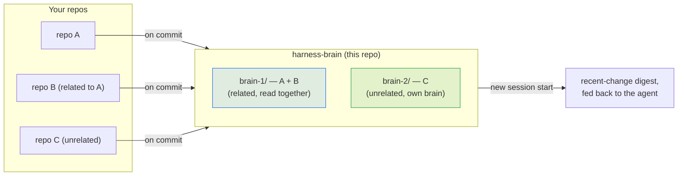

# Harness Brain

**The shared commit-memory for projects managed by [Harness Stack](https://github.com/cloudbloqavi/harness-stack).**

Harness Brain is a plain-Markdown, git-backed memory of *what changed and why*
across every project in your ecosystem. The `commit-brain-agent` writes a
detailed per-repo log here on each commit and rolls it up into a compact
per-brain digest; the `cross-repo-discovery-agent` reads those at session start
to surface a recent-change digest across a project and its related repos.

It is intentionally simple: human-readable Markdown, no database, no service —
just a repo you can grep, diff, and read.

---

## New here? Start with this

**No AI/ML background needed.** Harness Brain is just a git repository full of
Markdown files, laid out in a predictable folder structure. Think of it as a
shared changelog that an AI agent (from [Harness Stack](https://github.com/cloudbloqavi/harness-stack))
writes to automatically every time you commit, and reads from at the start of
a new session — so it remembers *what changed and why*, across all your
repos, without you re-explaining context every time.



**Jump to:** [Use harness-brain in your own project](#use-harness-brain-in-your-own-project)
· [Brains: how repos are grouped](#brains-how-repos-are-grouped) ·
[Deep dive](#deep-dive) · [Contributing](#contributing)

<a id="use-harness-brain-in-your-own-project"></a>

## 🚀 Use harness-brain in your own project

There are two ways to set this up, depending on how you're working.

### Path A — you use Harness Stack (recommended, easiest)

If you've installed the [`harness`](https://github.com/cloudbloqavi/harness-stack) CLI
in your project already, it can set up harness-brain for you as part of
`harness init` — no manual steps needed:

```bash
cd your-project
harness init --brain ../harness-brain                     # clone this repo, with worked examples
# or
harness init --brain ./memory --brain-source scaffold     # generate the same structure locally, offline
```

That's it — skip to [Brains: how repos are grouped](#brains-how-repos-are-grouped)
to understand the structure it just created for you. Full details of the
`init` flow live in the
[Harness Stack README](https://github.com/cloudbloqavi/harness-stack#optional-commit-memory-harness-brain).

### Path B — standalone setup (no Harness Stack CLI, or you want full manual control)

Useful if you want to inspect the structure first, wire it up by hand, or
you're contributing a new worked example to this repo.

**Step 1 — Clone this repo** (anywhere on disk — it doesn't need to live next
to your project):

```bash
git clone https://github.com/cloudbloqavi/harness-brain.git ../harness-brain
```

**Step 2 — Point your project's agent at it**, so `commit-brain-agent` (and
`cross-repo-discovery-agent`) know where to read/write:

```bash
export HARNESS_BRAIN_PATH=/absolute/path/to/harness-brain
```

Add that line to your shell profile (`~/.bashrc`, `~/.zshrc`, …) so it
persists across terminal sessions.

**Step 3 — Decide where your repo belongs.** Look at
[`projects/`](projects) and ask: *is this repo related to another repo already
in a brain* (e.g. an API and its web client — same product, different repos)?

- **Yes, related to an existing repo** → add your repo as a new folder **inside
  that repo's existing brain** (e.g. `projects/brain-1/your-repo/`).
- **No, it's independent** → give it its **own new brain**: the next unused
  number under `projects/` (e.g. if `brain-1` and `brain-2` exist, create
  `projects/brain-3/your-repo/`).

**Step 4 — Bootstrap the folder** using the templates in
[`_templates/`](_templates) as your guide:

```bash
mkdir -p projects/brain-3/your-repo
cp _templates/YY-MM-DD-HAR.md projects/brain-3/your-repo/26-07-03-HAR.md
# fill in the placeholders, following the worked examples under projects/ as a model
```

Then create (or update) the brain's **single** compact rollup at
`projects/brain-3/26-07-03-HAR-compact.md` from `_templates/YY-MM-DD-HAR-compact.md`
(one block per repo in the brain — see the [worked example](projects/brain-1/26-06-07-HAR-compact.md)).

**Step 5 — Commit and push.** From here on, if you've also set up Harness
Stack's `commit-brain-agent` (Path A does this automatically), it will keep
appending to your detailed log and refreshing the compact rollup on every
commit — you won't need to repeat Steps 3–4 by hand again.

### Troubleshooting

| Problem | Fix |
| --- | --- |
| Agent isn't writing to the brain | Confirm `HARNESS_BRAIN_PATH` is set and exported in the shell your AI tool runs in (not just a one-off terminal). |
| Not sure if two repos are "related" | Ask: does one depend on / get deployed with the other, or are they described as the same product? If yes → same brain. If they'd make sense open in separate contexts with no shared history → separate brains. |
| I already have a brain — how do I add a *new* repo to it later | Same as Step 3–4 above: add a new `projects/<existing-brain>/<new-repo>/` folder and a block in that brain's compact rollup. |

<a id="brains-how-repos-are-grouped"></a>

## Brains: how repos are grouped

A **brain** is a numbered folder under `projects/` that groups repositories.

- **Related repos share one brain.** A product split across several
  repositories (e.g. an API + its web client) puts all of those repos inside the
  **same** brain. The grouping is what marks them related, so the
  `cross-repo-discovery-agent` reads them **together**.
- **Unrelated repos each get their own brain.** Independent projects live in
  **separate** numbered brains (`brain-2`, `brain-3`, …) and are digested in
  isolation.

| Scenario | Example | What it shows |
| --- | --- | --- |
| **Related** — one product, many repos | [`brain-1/`](projects/brain-1) → `ledger-api` + `ledger-web` | Two repos of one product (Ledger) in **one** brain; `web` depends on `api`, read together. |
| **Unrelated** — independent repos | [`brain-2/`](projects/brain-2) `weather-cli`, [`brain-3/`](projects/brain-3) `markdown-linter` | Each unrelated repo in its **own** numbered brain. |

## Files: detailed logs vs the compact rollup

Each brain holds two kinds of file:

- **Detailed per-repo log** — one folder per repo, with dated detailed entries
  `YY-MM-DD-HAR.md`. Full content: what/why/files/cross-repo impact/flags. This
  is the source of record, appended per commit.
- **Compact brain rollup** — a **single** file at the brain root,
  `YY-MM-DD-HAR-compact.md`, regenerated daily. It is structured by project and
  carries the compacted, one-line-per-change view across the whole brain.

All dates are **fully numeric**: `YY-MM-DD` (e.g. `26-06-07` = 2026-06-07).

### The two files map onto agentic-loop state

The split is not just tidiness — it is what lets the brain act as a loop's
externalized **state**:

- The **compact rollup** is the *current-state digest*: small and current, it is
  what `harness seed` re-injects at the start of each loop iteration ("read the
  current state of the work before acting").
- The **detailed log** is the *audit trail*: the append-only record that closes
  the "quiet success" gap — read when a human needs the full why, never fed into
  the iteration seed.

See `harness-stack/docs/agentic-loop.md` for how the seed and verification gate
use these.

```
   project repo (on_commit)                          new session start
          |                                                  |
          v                                                  v
  +-------------------+                            +---------------------------+
  | commit-brain-     |   detailed log +           | cross-repo-discovery-     |
  |   agent           |   compact rollup           |   agent                   |
  +-------------------+--------------+             +-------------+-------------+
                                     v                           ^
                +-----------------------------------+    | read recent digest
                |            harness-brain           |    | across the brain
                |  projects/<brain>/                 |----+ (related repos
                |    <YY-MM-DD>-HAR-compact.md  (1×)  |      read together)
                |    <repo>/<YY-MM-DD>-HAR.md         |
                +-----------------------------------+
                  (located via HARNESS_BRAIN_PATH)
```

<a id="deep-dive"></a>

## 🔍 Deep dive

Everything below is reference material — the exact file formats, the full
directory layout, and how the agents read/write it. You don't need to read it
to get started; come back when you want the details.

## Layout

```
harness-brain/
├── README.md
├── _templates/
│   ├── YY-MM-DD-HAR.md            ← detailed per-repo entry format
│   └── YY-MM-DD-HAR-compact.md    ← brain-level compact rollup format
└── projects/
    ├── brain-1/                       ← RELATED repos (one product) share a brain
    │   ├── README.md                  ← brain index: product + member repos
    │   ├── 26-06-07-HAR-compact.md    ← single daily compact rollup (all repos)
    │   ├── ledger-api/
    │   │   ├── README.md
    │   │   └── 26-06-07-HAR.md        ← detailed log
    │   └── ledger-web/
    │       ├── README.md
    │       └── 26-06-07-HAR.md
    ├── brain-2/                       ← UNRELATED repo → its own brain
    │   ├── README.md
    │   ├── 26-06-05-HAR-compact.md
    │   └── weather-cli/
    │       ├── README.md
    │       └── 26-06-05-HAR.md
    └── brain-3/                       ← another UNRELATED repo → another brain
        ├── README.md
        ├── 26-06-03-HAR-compact.md
        └── markdown-linter/
            ├── README.md
            └── 26-06-03-HAR.md
```

- **One brain per group of related repos**, numbered `brain-1`, `brain-2`, …
- **One folder per repo** inside its brain, named after the repo.
- **Detailed logs** are `YY-MM-DD-HAR.md` per repo; multiple commits on the same
  day append to that day's file.
- **One compact rollup** per brain, `YY-MM-DD-HAR-compact.md`, regenerated daily.
- Brains, repo folders, and READMEs are bootstrapped on a repo's first commit.

## Entry format

See [`_templates/YY-MM-DD-HAR.md`](_templates/YY-MM-DD-HAR.md) for the detailed
per-repo entry and [`_templates/YY-MM-DD-HAR-compact.md`](_templates/YY-MM-DD-HAR-compact.md)
for the brain rollup. The worked examples under [`projects/`](projects/) show
both the related-repos and unrelated-repos cases end to end.

## How it is written

The `commit-brain-agent` (defined in `harness-stack/.subagents/`) runs on
`on_commit`, reads the diff + commit message, appends a detailed entry to the
repo's `YY-MM-DD-HAR.md`, and refreshes its brain's `YY-MM-DD-HAR-compact.md`
rollup. It is designed to **never block a commit** — on any error it logs to
stderr and exits 0.

Point the agent at this repo with the `HARNESS_BRAIN_PATH` environment variable:

```bash
export HARNESS_BRAIN_PATH=/path/to/harness-brain
```

## How it is read

The `cross-repo-discovery-agent` runs at session start. For the current repo it
locates the repo's brain, reads the recent compact rollup plus the detailed logs
of every repo in that brain (related repos, read together), and produces a
digest. A repo in its own brain is digested in isolation.

<a id="contributing"></a>

## 🤝 Contributing

This repo is open source (MIT) and **contributions are welcome**, code
experience optional. Good starting points:

- **Add a worked example** under `projects/` — a third "related repos" or
  "unrelated repos" scenario helps future readers more than another paragraph
  of prose.
- **Improve `_templates/`** — the entry formats that every real brain follows.
- **Improve this README** — if a step confused you, it'll confuse the next
  person too; tell us where.
- **Work on the writer/reader agents** — `commit-brain-agent` and
  `cross-repo-discovery-agent` live in the
  [harness-stack](https://github.com/cloudbloqavi/harness-stack) repo.

**Quick setup** (this repo is plain Markdown — no build step, no dependencies):

```bash
git clone https://github.com/cloudbloqavi/harness-brain.git
cd harness-brain
```

Make your change, following the existing files' format and style (all dates
`YY-MM-DD`, one compact rollup per brain, one detailed log per repo per day —
see [Files: detailed logs vs the compact rollup](#files-detailed-logs-vs-the-compact-rollup)).

If your change touches `README.md`, `_templates/`, or `projects/`, note that
[harness-stack](https://github.com/cloudbloqavi/harness-stack) keeps an
offline mirror of this repo at `templates/brain/` and its CI checks that the
two stay byte-identical — a companion PR there may be needed for a structural
change to land cleanly (a docs-only fix, like a typo, does not need one).

Full guide: see [**CONTRIBUTING.md**](CONTRIBUTING.md). Questions? Open a
[GitHub issue](https://github.com/cloudbloqavi/harness-brain/issues).

## License

MIT — see [LICENSE](LICENSE).
